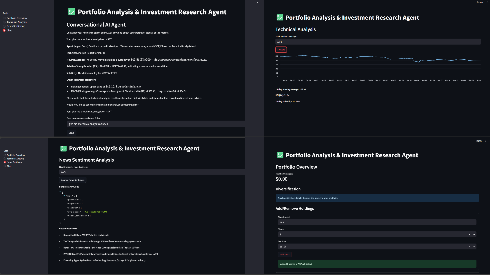

# AI Finance Agent 💹

A free, privacy-preserving AI-powered portfolio analysis and investment research agent. Integrates real-time stock data, news sentiment, technical analysis, and conversational AI (local LLM via Ollama) – all in a beautiful Streamlit dashboard.

---

## 🚀 Features

- **Conversational AI Agent:**
  - Chat with a local LLM (Ollama) for personalized investment research and portfolio Q&A.
- **Portfolio Management:**
  - Add/remove stocks, track holdings, and view diversification.
- **Technical Analysis:**
  - Visualize moving averages, RSI, and volatility for any stock.
- **News Sentiment Analysis:**
  - See real-time news sentiment for your stocks using NewsAPI and Hugging Face models.
- **No API Costs, Full Privacy:**
  - All LLM inference runs locally using Ollama (no OpenAI API required).

---

## 🖥️ Demo



---

## 🛠️ Installation

### 1. **Clone the Repository**
```bash
git clone https://github.com/FDC0178/AI-FinancialAnalyst.git
cd AI-FinancialAnalyst
```

### 2. **Install Python Dependencies**
```bash
pip install -r requirements.txt
```

### 3. **Install and Set Up Ollama**
- Download Ollama for Windows/Mac/Linux: [https://ollama.com/download](https://ollama.com/download)
- Add the Ollama install directory to your system PATH (see [Ollama docs](https://github.com/jmorganca/ollama)).
- Start the Ollama server:
  ```bash
  ollama serve
  ```
- Pull a supported model (small models like `phi` recommended for low-memory systems):
  ```bash
  ollama pull phi
  # or try: ollama pull mistral, ollama pull orca-mini, etc.
  ```

### 4. **Set Environment Variables**
- Create a `.env` file or set in your shell:
  - `NEWSAPI_KEY` – Get a free API key at [https://newsapi.org/](https://newsapi.org/)
  - (Optional) `OLLAMA_MODEL` – e.g. `phi`, `mistral`, `llama3.2` (default is `phi`)

### 5. **Run the App**
```bash
streamlit run main.py
```
Then, open [http://localhost:8501](http://localhost:8501) in your browser.

---

## 🧠 Usage
- **Portfolio Overview:**
  - Add/remove stocks, view diversification, Sharpe ratio, and volatility.
- **Technical Analysis:**
  - Enter a stock symbol to visualize key technical indicators.
- **News Sentiment:**
  - Enter a stock symbol to see recent headlines and sentiment.
- **Chat:**
  - Ask the AI anything about your portfolio, stocks, or markets. Example prompts:
    - "What is the technical analysis for MSFT?"
    - "Summarize the news sentiment for AAPL."
    - "How diversified is my portfolio?"

---

## 📝 Project Structure
```
├── agent.py                # LangChain agent logic (Ollama LLM, tools, prompt)
├── ai_analysis.py          # Technical indicator calculations
├── portfolio_manager.py    # Portfolio management logic
├── news_sentiment.py       # News fetching & sentiment analysis
├── main.py                 # Streamlit UI
├── requirements.txt        # Python dependencies
└── README.md               # Project documentation
```

---

## 🤖 Tech Stack
- **Python 3.8+**
- **Streamlit** – UI
- **LangChain** – Agent orchestration
- **Ollama** – Local LLM backend
- **yfinance** – Stock data
- **Hugging Face Transformers** – Sentiment analysis
- **NewsAPI** – News headlines

---

## 🛡️ Privacy & Cost
- All LLM inference is local (no OpenAI API required).
- Your financial data never leaves your machine.
- Free to use, no API costs for LLM.

---

## 🙋‍♂️ Contributing
Pull requests are welcome! For major changes, please open an issue first to discuss what you would like to change.

---

## 📄 License
MIT License. See [LICENSE](LICENSE) for details.

---

## 💼 Author
- [FDC0178](https://github.com/FDC0178)

---

## ⭐️ If you like this project...
Give it a star on GitHub and add it to your resume/portfolio!
